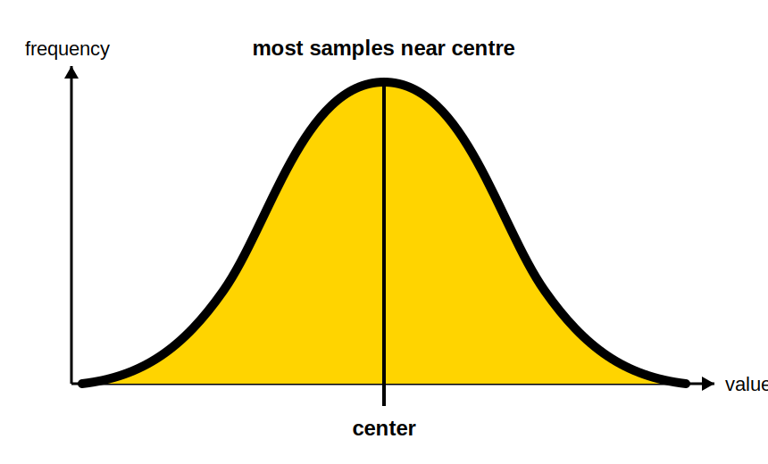
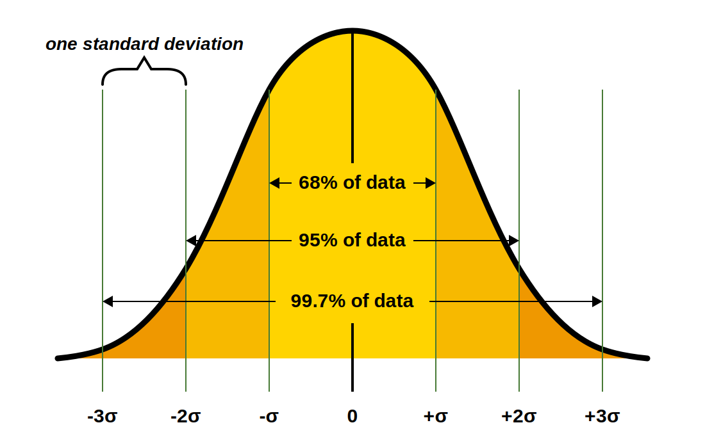
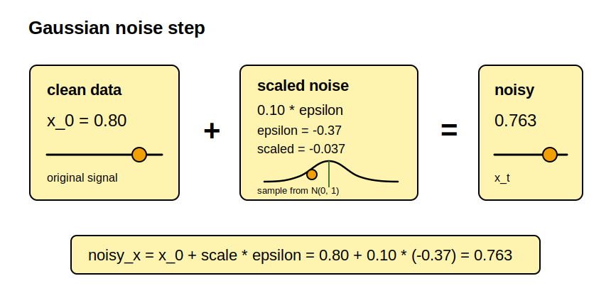
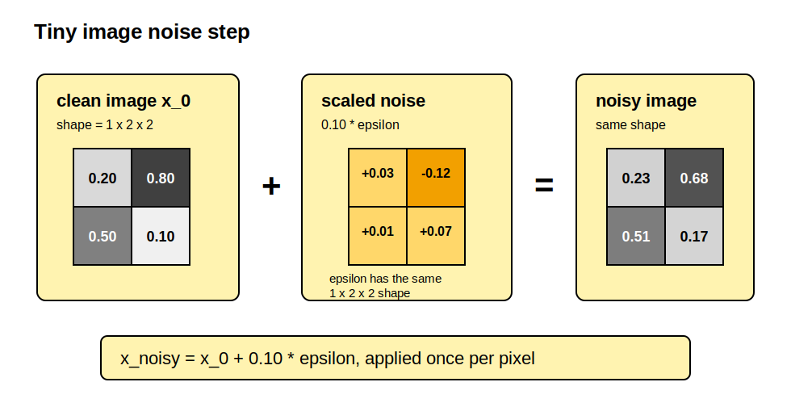

# Diffusion Math, From Paper To Code

This note is the scratchpad we will keep returning to while building diffusion
models for VLA. It starts from the basic idea of adding and removing noise, then
gradually connects that idea to images, text, and robot actions.

The goal is not to memorize every formula on the first pass. The goal is to
notice the repeating pattern:

1. Define a corruption process that turns data into noise.
2. Train a network to predict how to reverse that corruption.
3. Sample by starting from noise and repeatedly applying the learned reverse
   dynamics.

## Contents

```text
0. Probability, Noise, And Data Types
   Bell-shaped distributions, Gaussian noise, and continuous vs discrete data.

1. Continuous DDPM: Gaussian Diffusion For Real-Valued Data
   The core DDPM setup: add Gaussian noise, train a denoiser, sample backward.

2. Score View
   A probability-theory view of denoising as moving toward higher likelihood.

3. Flow Matching
   A diffusion-like alternative that learns a motion field from noise to data.

4. Image Diffusion
   How the same continuous math scales from points to image tensors.

5. Text Diffusion And SEDD
   Why token diffusion is discrete and why SEDD learns categorical ratios.

6. Action Diffusion
   How robot action chunks become the data being denoised.

7. VLA Bridge
   How VLM context plus diffusion actions gives us GR00T/pi0.5/Alpamayo-style
   systems.
```

Keep one question in mind while reading: "What is `x` in this section?" In
image diffusion, `x` may be an image. In text diffusion, it may be tokens. In
robotics, it may be a future action trajectory. The diffusion pattern stays
similar, but the meaning of the data changes.

## 0. Probability, Noise, And Data Types

Before choosing a diffusion method, we need three basic ideas:

```text
distribution: a pattern describing which values are likely
noise: random values sampled from a distribution
data type: the kind of thing the model is trying to generate
```

Diffusion models are built from those pieces. We pick a noise distribution, use
it to corrupt data, then train a model to undo that corruption.

### What A Bell-Shaped Distribution Is

A bell-shaped distribution is a pattern where values near the center happen
often, and values far from the center happen rarely.

For example, imagine taking many random samples and counting how often each
value appears. A bell-shaped distribution looks roughly like this:



The center is the value the distribution clusters around. The spread tells us
how wide the bell is.

Narrow bell:

```text
most samples stay very close to the center
```

Wide bell:

```text
samples can wander farther away from the center
```

In diffusion, this matters because Gaussian noise is bell-shaped. Most noise
values are small, so each noising step usually nudges the data a little. Very
large noise values can happen, but they are less likely.

### Standard Deviation

Standard deviation is a number that describes how spread out the bell is. It is
usually written as `sigma`.



Small standard deviation:

```text
values stay close to the center
```

Large standard deviation:

```text
values spread farther away from the center
```

In diffusion, increasing the noise scale makes the noisy sample drift farther
from the clean data. Decreasing the noise scale keeps it closer.

### What Gaussian Noise Means

Gaussian noise means random values drawn from a bell-shaped distribution. Most
samples are close to the mean, and large positive or negative samples are
possible but less common.

The notation for a Gaussian distribution uses the letter `N`, which stands for
normal distribution. "Gaussian distribution" and "normal distribution" mean the
same thing here.

For one number, the format is:

```text
x ~ N(mu, sigma^2)
```

Read this aloud as:

```text
x is sampled from a normal distribution with mean mu and variance sigma^2
```

Symbols:

```text
x: sampled value
mu: mean, or center of the distribution
sigma: standard deviation, or typical distance from the mean
sigma^2: variance
~: "is sampled from"
N(...): normal/Gaussian distribution
```

Examples:

```text
N(0, 1): centered at 0 with standard deviation 1
N(0, 4): centered at 0 with standard deviation 2, because sigma^2 = 4
N(5, 4): centered at 5 with standard deviation 2
```

The probability density is:

```text
p(x) = 1 / sqrt(2 pi sigma^2) * exp(-(x - mu)^2 / (2 sigma^2))
```

You do not usually calculate this density by hand when training a diffusion
model. The important part is understanding what the notation means.

### What A Covariance Matrix Means

For one number, the Gaussian has one variance value:

```text
x ~ N(mu, sigma^2)
```

That `sigma^2` controls how much one sampled number usually moves away from
the mean.

But diffusion usually works with many numbers at once. An image has many pixel
values. A robot action can have several control values. An action chunk has
several actions over several future timesteps.

For many numbers, we need more than one variance value. We need a place to
store:

```text
the variance for each dimension
optional relationships between dimensions
```

That storage place is the covariance matrix, written with an uppercase Greek
sigma:

```text
x ~ N(mu, Sigma)
```

Important notation:

```text
sigma^2: one variance value for a one-number Gaussian
Sigma: a covariance matrix for a many-number Gaussian
```

For example, a tiny robot action might have two values:

```text
x = [move_left_right, open_close_gripper]
```

If we add noise to this action, we need one noise value for `move_left_right`
and another noise value for `open_close_gripper`.

Symbols:

```text
x: sampled vector
mu: mean vector, one center value per dimension
Sigma: covariance matrix
```

The mean vector could be:

```text
mu = [0, 0]
```

That means:

```text
move_left_right noise is centered at 0
open_close_gripper noise is centered at 0
```

The covariance matrix could look like this:

```text
Sigma = [ 1  0 ]
        [ 0  1 ]
```

The two `1` values are variances. They are on the diagonal:

```text
Sigma = [ diagonal      off-diagonal ]
        [ off-diagonal  diagonal     ]
```

For our robot action:

```text
top-left 1: variance for move_left_right
bottom-right 1: variance for open_close_gripper
```

Variance means "how much that value usually moves away from its mean."

```text
larger variance: bigger random movement
smaller variance: smaller random movement
variance 1: standard Gaussian amount of movement
```

The two `0` values are covariances. They are off the diagonal:

```text
top-right 0: relationship from move_left_right to open_close_gripper
bottom-left 0: relationship from open_close_gripper to move_left_right
```

Covariance means "do these two values tend to move together?"

```text
positive covariance: they tend to move in the same direction
negative covariance: they tend to move in opposite directions
zero covariance: they are treated as independent
```

So this matrix:

```text
I = [ 1  0 ]
    [ 0  1 ]
```

means:

```text
each dimension has variance 1
the dimensions do not influence each other
```

So variance and covariance have different jobs:

```text
variance: controls one dimension by itself
covariance: describes the relationship between two dimensions
```

Another covariance matrix could look like this:

```text
Sigma = [ 1    0.8 ]
        [ 0.8  1   ]
```

Read it as:

```text
top-left 1: move_left_right has variance 1
bottom-right 1: open_close_gripper has variance 1
top-right 0.8: the two values tend to move together
bottom-left 0.8: the same relationship, mirrored
```

The positive covariance `0.8` means the two noise values are related. If
`move_left_right` gets a positive noise value, `open_close_gripper` is more
likely to get a positive noise value too. If one gets a negative noise value,
the other is more likely to be negative too.

For beginner diffusion examples, we usually avoid covariance between dimensions:

```text
epsilon ~ N(0, I)
```

It means:

```text
sample a noise vector epsilon
center every noise dimension at 0
give every dimension variance 1
make the dimensions independent
```

### Example: Adding Noise To One Clean Data Point

Let's do one small example before we move into the full diffusion equations.
Start with a single clean data point:

```text
x_0 = 0.80
```

Now sample one Gaussian noise value:

```text
epsilon = -0.37
epsilon ~ N(0, 1)
```

If we added all of `epsilon`, the data point would move a lot. Instead, we scale
the noise down. Here the scale is `0.10`, so we only add a small amount of
noise.



Gaussian noise is random numeric variation sampled from a normal distribution.
In diffusion, we add this noise according to a controlled noise schedule, then
train a model to estimate the noise component so the sample can be denoised.

### Example: Adding Noise To A Tiny Image

Now let's repeat the same idea with an image. The scalar example had one clean
number and one noise number. An image has many numbers, so we add noise to every
pixel value.

We will do four steps:

```text
1. Start with a tiny clean image.
2. Sample a noise value for each pixel.
3. Scale the noise down.
4. Add the scaled noise to the clean image.
```

To keep the math small, imagine a grayscale image with one channel, two rows,
and two columns:

```text
x_0 shape = 1 x 2 x 2
```

The clean image values might be:

```text
x_0 = [
  [0.20, 0.80],
  [0.50, 0.10]
]
```

Because `x_0` has four values, the noise `epsilon` also has four values:

```text
epsilon = [
  [ 0.30, -1.20],
  [ 0.10,  0.70]
]
epsilon ~ N(0, I)
```

For this tiny image, there are four pixel values, so the covariance matrix
would have four rows and four columns. Using `I` means each pixel's noise is
independent:

```text
I = [
  [1, 0, 0, 0],
  [0, 1, 0, 0],
  [0, 0, 1, 0],
  [0, 0, 0, 1]
]
```

Read it as:

```text
each diagonal 1: that pixel gets variance 1
each off-diagonal 0: that pixel's noise is independent from the others
```

If we use a small noise scale of `0.10`, then:



```text
x_noisy = x_0 + 0.10 * epsilon
```

Element by element:

```text
x_noisy = [
  [0.20 + 0.10 *  0.30,  0.80 + 0.10 * -1.20],
  [0.50 + 0.10 *  0.10,  0.10 + 0.10 *  0.70]
]
```

So:

```text
x_noisy = [
  [0.23, 0.68],
  [0.51, 0.17]
]
```

The important point is not the specific numbers. The important point is that
every pixel gets its own noise value, and the noisy image keeps the same shape
as the clean image.

### Continuous Vs Discrete Data

Now that Gaussian noise has a meaning, we can ask where it does and does not
fit.

Continuous data is made of real numbers. The values can slide smoothly between
nearby possibilities:

```text
0.10, 0.11, 0.12, ...
```

Examples:

```text
image pixels after normalization
audio waveforms
2D or 3D points
robot joint positions
robot end-effector deltas
future action trajectories
```

For continuous data, Gaussian noise makes sense. If a robot action value is
`0.40`, then `0.41` is a small change and `0.90` is a bigger change. The notion
of distance is meaningful.

Discrete data is made of categories. The values are chosen from a fixed set,
and the numeric IDs are usually just labels:

```text
token 42, token 43, token 44, ...
```

Examples:

```text
text tokens
characters
vocabulary IDs
class labels
symbolic action codes
```

For discrete data, Gaussian noise on the IDs usually does not make sense. Token
`42` is not necessarily "close" in meaning to token `43`. The number is just an
index in a vocabulary. So text diffusion usually corrupts tokens by masking,
replacing, or moving through a categorical transition process.

This gives us the first split in the project:

```text
continuous diffusion:
  images, points, audio, robot actions
  common noise: Gaussian

discrete diffusion:
  text, tokens, categories
  common noise: masking or categorical replacement
```

VLA systems use both worlds. Vision features and robot actions are usually
continuous or embedded into continuous vectors. Language starts as discrete
tokens, then becomes continuous embeddings inside a neural network.

That is why we will study continuous diffusion first, then text diffusion, then
action diffusion for robotics.

## 1. Continuous DDPM: Gaussian Diffusion For Real-Valued Data

Now that Gaussian noise and continuous data are defined, we can write the basic
DDPM setup. This is the version of diffusion used for real-valued data such as
points, images, audio, and robot actions.

Let clean data be `x_0`, such as a point, image, or action trajectory. The
subscript `0` means "before we added any noise." As diffusion progresses, we
move from `x_0` to noisier versions called `x_1`, `x_2`, and so on until `x_T`,
which should look almost like pure noise.

Symbols for this section:

```text
x_0: clean data sample
x_t: noisy version of x_0 at diffusion step t
t: diffusion timestep, usually an integer from 1 to T
T: total number of diffusion steps
epsilon: Gaussian noise sampled from N(0, I)
I: covariance matrix with variance 1 and independent dimensions
theta: neural network parameters
```

The first design choice is how aggressively to add noise. We do not dump all
the noise in at once. Instead, we add a tiny amount at every step. That sequence
of tiny noise amounts is called the variance schedule.

```text
beta_t in (0, 1)
alpha_t = 1 - beta_t
alpha_bar_t = product_{s=1..t} alpha_s
```

Schedule symbols:

```text
beta_t: amount of new noise added at step t
alpha_t: amount of signal kept after adding noise at step t
alpha_bar_t: cumulative signal kept from step 0 through step t
```

Intuitively, `beta_t` is the "noise knob" for step `t`. If `beta_t` is small,
the sample changes only slightly. If it is large, the sample gets corrupted
faster. `alpha_t` is the matching "keep knob": it says how much of the old
signal survives that step.

The forward noising process describes one small corruption step:

```text
q(x_t | x_{t-1}) = N(sqrt(alpha_t) x_{t-1}, beta_t I)
```

Forward-process symbols:

```text
q(...): fixed forward corruption distribution, not learned
q(x_t | x_{t-1}): probability of the next noisy sample given the previous one
N(mean, covariance): Gaussian distribution
sqrt(alpha_t) x_{t-1}: mean of the next noisy sample
beta_t I: covariance of the Gaussian noise added at this step
```

Read this as: "to get `x_t`, shrink the previous sample a little, then add
Gaussian noise." The distribution `q` is fixed. It is not a neural network. We
choose this corruption process ourselves so that training data can be noised in
a controlled way.

A useful trick is that we do not have to apply every small noising step one by
one during training. There is a closed-form equation that jumps directly from
clean `x_0` to noisy `x_t`:

```text
q(x_t | x_0) = N(sqrt(alpha_bar_t) x_0, (1 - alpha_bar_t) I)
x_t = sqrt(alpha_bar_t) x_0 + sqrt(1 - alpha_bar_t) epsilon
epsilon ~ N(0, I)
```

Closed-form symbols:

```text
q(x_t | x_0): direct distribution of x_t given the clean sample
sqrt(alpha_bar_t) x_0: remaining clean signal at step t
sqrt(1 - alpha_bar_t) epsilon: accumulated noise at step t
~: "is sampled from"
```

This is the equation you will see in almost every diffusion implementation. It
says a noisy sample is just a weighted mixture of clean data and random noise.
Early in the process, `alpha_bar_t` is close to `1`, so the clean signal
dominates. Late in the process, `alpha_bar_t` is close to `0`, so noise
dominates.

Now comes the learning part. The denoiser receives `(x_t, t, conditioning)` and
tries to predict what would help reverse the corruption:

```text
epsilon_theta(x_t, t)  # noise prediction
x0_theta(x_t, t)       # clean data prediction
v_theta(x_t, t)        # velocity prediction
```

Denoiser symbols:

```text
epsilon_theta: neural network prediction of the noise epsilon
x0_theta: neural network prediction of the original clean data x_0
v_theta: neural network prediction of a velocity-style target
conditioning: optional context, such as text, image tokens, or robot state
```

For a minimal DDPM, the easiest target is the exact noise we added. Since we
created `x_t` ourselves, we know the noise `epsilon`. So we train the network to
recover it:

```text
L = E_{x0, epsilon, t} || epsilon - epsilon_theta(x_t, t) ||_2^2
```

Loss symbols:

```text
L: training loss
E_{x0, epsilon, t}: average over clean samples, noise samples, and timesteps
|| ... ||_2^2: squared Euclidean distance
```

This loss is practical because the training target is known. We add the noise
ourselves, so we can directly train the model to predict the exact noise that
was used to create `x_t`.

Sampling reverses the story. We start from random noise and repeatedly ask the
model how to take one step toward cleaner data. The learned reverse step is:

```text
p_theta(x_{t-1} | x_t) = N(mu_theta(x_t, t), sigma_t^2 I)
```

Reverse-process symbols:

```text
p_theta(...): learned reverse denoising distribution
mu_theta: neural network-derived mean for the reverse step
sigma_t: standard deviation used when sampling the reverse step
```

For epsilon prediction, the reverse-step mean is computed from the predicted
noise:

```text
mu_theta =
  1 / sqrt(alpha_t) *
  (x_t - beta_t / sqrt(1 - alpha_bar_t) * epsilon_theta(x_t, t))
```

You do not need to memorize this formula at first. The main idea is: use the
model's noise prediction to estimate where a slightly cleaner sample should be.
Then optionally add a little randomness so sampling stays generative:

```text
x_{t-1} = mu_theta + sigma_t z
z ~ N(0, I), except z = 0 at t = 1
```

Sampling symbols:

```text
z: fresh Gaussian noise added during sampling
x_{t-1}: slightly less noisy sample after one reverse step
```

## 2. Score View

The score view is another way to describe the same behavior. Instead of saying
"predict the noise," we can say "predict the direction that moves a noisy sample
toward higher probability data."

The score is the gradient of log probability:

```text
score(x_t, t) = grad_x log q_t(x_t)
```

Score symbols:

```text
score(x_t, t): direction that increases the log probability of x_t
grad_x: gradient with respect to x
log q_t(x_t): log probability of noisy samples at timestep t
q_t: marginal distribution of x_t after t noising steps
```

Imagine standing somewhere in noisy data space. The score points uphill toward
regions that are more likely under the data distribution at that noise level.
For Gaussian corruption, this score is proportional to the noise:

```text
score_theta(x_t, t) approx -epsilon_theta(x_t, t) / sqrt(1 - alpha_bar_t)
```

Here `approx` means the model prediction is an estimate, not an exact analytic
quantity.

This is why "predict noise" and "learn the score" are two faces of the same
idea in continuous diffusion. Noise prediction is often easier to implement,
while score language is often easier to connect to probability theory.

## 3. Flow Matching

Modern VLA action heads often use diffusion-like flow matching. Instead of a
discrete reverse Markov chain, we learn a vector field that transports noise to
data.

The beginner-friendly picture is: rather than taking hundreds of denoising
steps, learn a smooth motion field that tells each noisy sample how to flow
toward data. A simple interpolation path is:

```text
x_t = (1 - t) x_0 + t x_1
x_0 ~ data
x_1 ~ N(0, I)
t in [0, 1]
```

Flow-matching symbols:

```text
x_0: clean data endpoint
x_1: noise endpoint
x_t: point along the path between data and noise
t: continuous time between 0 and 1
data: the real training data distribution
```

At `t = 0`, this path is at the clean data point. At `t = 1`, it is at the noise
point. Because the path is a straight line, the true velocity is simple:

```text
u_t = d x_t / dt = x_1 - x_0
```

Velocity symbols:

```text
u_t: true velocity of the path at time t
d x_t / dt: derivative of x_t with respect to time
```

Then we train a neural network to predict that velocity:

```text
L = E || u_theta(x_t, t, conditioning) - u_t ||_2^2
```

Here `u_theta` is the neural network's predicted velocity field.

To sample, we start with noise and integrate the learned motion field toward the
data side:

```text
dx / dt = u_theta(x, t, conditioning)
```

ODE symbols:

```text
dx / dt: how the sample changes as continuous time changes
x: current sample being transported by the learned vector field
```

In practice, papers vary the path direction and parameterization. Do not let
that obscure the main idea: learn how noisy action chunks should move toward
clean action chunks.

## 4. Image Diffusion

Image diffusion is the same continuous math, just applied to bigger tensors. An
image is a grid of numbers. After normalization, each pixel/channel value is a
real number, so the DDPM equations still apply.

```text
x_0 in R^{C x H x W}
```

Image symbols:

```text
R: real numbers
C: number of channels, such as 1 for grayscale or 3 for RGB
H: image height
W: image width
```

The main difference is architectural. A tiny MLP is enough for 2D points, but
images need models that understand spatial structure:

```text
2D toy points -> MLP denoiser
small images -> U-Net denoiser
modern large images -> DiT/transformer denoiser in latent space
```

Conditioning can be added with class embeddings, text embeddings, cross-attention,
or adapter features.

This is the bridge to text-to-image systems: the image is denoised as continuous
data, while the text prompt becomes conditioning information that guides the
denoiser.

## 5. Text Diffusion And SEDD

Text diffusion is trickier because text is not naturally continuous. A token ID
like `42` is not "close" to token ID `43` in the same way pixel value `0.42` is
close to `0.43`. Token IDs are categories, not measurements.

That means Gaussian noise on token IDs is the wrong primitive.

Instead, define a discrete corruption process over vocabulary states. Common
choices include:

```text
masking: tokens become [MASK]
uniform replacement: tokens jump to random vocabulary items
absorbing state: once masked, tokens stay masked until reverse denoising
```

The easiest mental model is masked text. Start with a sentence, randomly replace
some tokens with `[MASK]`, then train a model to reconstruct or resample the
missing pieces. More advanced discrete diffusion methods make this process
mathematically closer to continuous score matching.

SEDD, Score Entropy Discrete Diffusion, learns ratios/scores between discrete
states rather than a continuous score vector. Conceptually:

```text
continuous diffusion: learn grad_x log p_t(x)
discrete diffusion: learn ratios p_t(y) / p_t(x) for token transitions x -> y
```

Discrete symbols:

```text
x: current token/state
y: possible next token/state
p_t(x): probability of token/state x at diffusion time t
p_t(y) / p_t(x): probability ratio between two discrete states
```

For this project, the first SEDD-style implementation should stay small:

```text
dataset: tiny character-level corpus
state: sequence of categorical tokens
noise: random masking or categorical transition
model: small transformer
loss: score-entropy or masked-token denoising as a bridge objective
sampling: iteratively unmask/resample tokens
```

We can start with a masked diffusion language model, then move closer to the
full SEDD objective once the mechanics are visible.

## 6. Action Diffusion

Action diffusion is where the math starts to look like robotics. A single robot
action is usually a continuous vector: joint targets, end-effector deltas,
velocities, gripper commands, or some mixture of these.

Instead of predicting only the next action, modern policies often predict a
short future chunk:

```text
a_{t:t+H} in R^{H x action_dim}
```

Action symbols:

```text
a_{t:t+H}: action chunk from current time t through horizon t + H
H: number of future action steps predicted at once
action_dim: number of control values per step
R^{H x action_dim}: real-valued action matrix
```

Chunking matters because robot motion should be smooth. Predicting several
future steps at once lets the model generate coherent short-horizon behavior
instead of twitchy one-step commands.

Conditioning usually includes:

```text
camera tokens
language instruction tokens
proprioception / robot state
history tokens
optional reasoning text
```

The action diffusion objective is the same as continuous DDPM or flow matching,
but now the data sample is an action chunk:

```text
noise a_chunk -> train model to denoise it given context
```

For example, given an image of a mug, the instruction "pick up the mug," and the
robot's current joint state, the action denoiser learns to turn random noisy
future actions into a plausible grasping trajectory.

The key robotics-specific design decisions are:

```text
horizon H
action representation: joint deltas, end-effector deltas, gripper commands
control frequency
normalization per robot embodiment
conditioning architecture
number of denoising steps allowed at inference
```

## 7. VLA Bridge

A modern VLA diffusion stack combines semantic understanding with continuous
control. The VLM side answers, "What is happening, and what should be done?"
The diffusion or flow action side answers, "What precise motor trajectory should
the robot execute next?"

So the stack has two jobs:

```text
VLM / semantic system:
  read images and language, produce context or reasoning tokens

action expert:
  generate a smooth continuous action chunk with diffusion or flow matching
```

This is the line from simple diffusion math to GR00T/pi0.5/Alpamayo-style
systems. The math starts with denoising `x_t`; the VLA version denoises future
actions while using images, language, proprioception, and sometimes reasoning
tokens as context.
