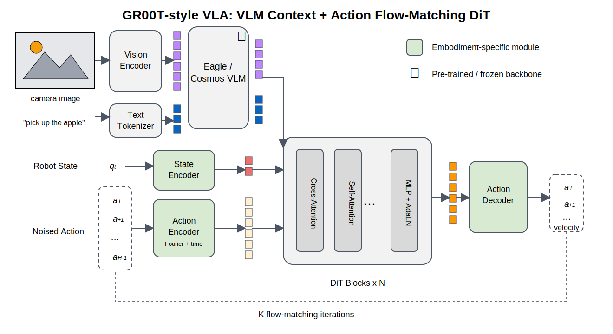

# GR00T-Style Model Walkthrough

This walkthrough explains the GR00T-style code path in this repo. It is based
on the public Isaac-GR00T implementation shape, especially the N1.7 action head.



## Core Idea

GR00T separates the problem into two systems:

```text
System 2:
  vision-language backbone builds semantic context tokens

System 1:
  action flow expert turns noisy action chunks into clean motor actions
```

In our code:

```text
qkvla/models/groot.py
qkvla/models/action_experts.py
qkvla/modules/action_projection.py
```

## Data Flow

1. Images and language become VLM context tokens.
2. Robot state goes through a state encoder inside the action expert.
3. The noisy action chunk goes through a per-waypoint action encoder.
4. The action encoder also receives the flow timestep.
5. A DiT-style expert cross-attends to VLM context tokens.
6. The action decoder predicts a velocity field.

The flow target follows the GR00T public code pattern:

```text
noisy = (1 - t) * noise + t * actions
target_velocity = actions - noise
```

At inference, we start from noise and use Euler integration:

```text
actions = actions + dt * predicted_velocity
```

## What Is Exact Locally

The local code now mirrors these visible public mechanics:

```text
state encoder is separate from VLM context
action projection includes timestep features
action decoder is embodiment/category-specific
flow matching predicts actions - noise
```

## What Is Still A Placeholder

The production backbone is not recreated locally:

```text
Cosmos/Qwen/Eagle-style VLM -> ToyVLMContext
AlternateVLDiT details -> local AdaLN transformer expert
full embodiment configs -> small CategorySpecificMLP bank
```

That is intentional for learning. We build the mechanism first, then replace
toy components with real backbones.

