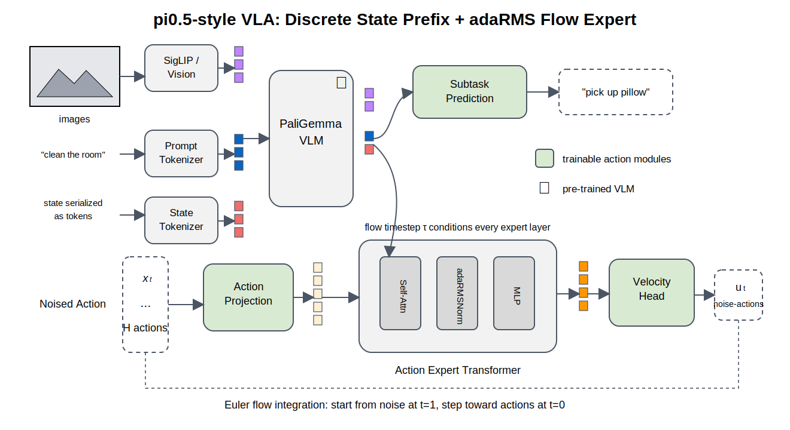

# pi0.5-Style Model Walkthrough

This walkthrough explains the pi0.5-style code path in this repo. It is based
on the public OpenPI implementation of pi0/pi0.5.



## Core Idea

pi0.5 builds on pi0. The public OpenPI config says pi0.5 differs in two key
ways:

```text
1. Robot state is represented as discrete language-side input.
2. The action expert uses adaRMSNorm to inject the flow timestep.
```

In our code:

```text
qkvla/models/pi05.py
qkvla/models/action_experts.py
qkvla/modules/transformer.py
qkvla/modules/norms.py
```

## Data Flow

1. Images and language form a VLM prefix.
2. State should be included in the discrete prompt path.
3. The model can predict a high-level semantic subtask.
4. Noisy action tokens go to a flow action expert.
5. The flow time conditions transformer layers through adaptive RMSNorm.
6. The action expert predicts a velocity field.

The OpenPI flow training convention is:

```text
x_t = t * noise + (1 - t) * actions
target_velocity = noise - actions
```

Sampling starts from noise at `t = 1` and integrates toward `t = 0`.

## What Is Exact Locally

The local code now mirrors these visible OpenPI mechanics:

```text
pi0.5 keeps state out of the continuous suffix path
flow expert predicts velocity
adaRMSNorm injects timestep condition
OpenPIFlowMatchingPath implements the OpenPI flow convention
```

## What Is Still A Placeholder

The production VLM is not recreated locally:

```text
PaliGemma/Gemma -> ToyVLMContext
OpenPI tokenizer/state transforms -> simple token_ids input
Gemma action expert -> local transformer action expert
```

The next learning step is to build a small tokenizer path that turns robot state
into discrete prompt tokens, matching the pi0.5 idea more closely.

