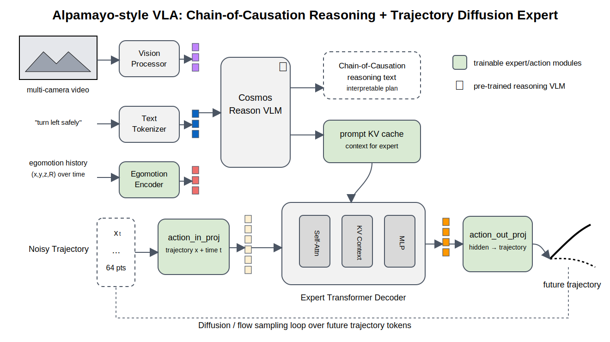

# Alpamayo-Style Model Walkthrough

This walkthrough explains the Alpamayo-style code path in this repo. It is
based on the public Alpamayo Autoware implementation shape.



## Core Idea

Alpamayo is a reasoning VLA for trajectory planning. The visible public
implementation separates:

```text
reasoning VLA:
  builds context and reasoning output

expert trajectory decoder:
  receives noisy future trajectory x and diffusion/flow time t
  predicts the denoising update for trajectory generation
```

In our code:

```text
qkvla/models/alpamayo.py
qkvla/models/action_experts.py
qkvla/modules/encoders.py
```

## Data Flow

1. Camera/video, text, and egomotion history become context tokens.
2. A reasoning bridge creates reasoning tokens.
3. Noisy future trajectory tokens are projected with time `t`.
4. The expert decoder attends to context plus reasoning tokens.
5. The output projection maps hidden states back to trajectory/action space.

The public Alpamayo code exposes this split:

```text
action_in_proj(x, t)
expert(...)
action_out_proj(...)
```

Our local version keeps the same conceptual interface.

## What Is Exact Locally

The local code now mirrors these visible mechanics:

```text
egomotion/history tokens are part of context
reasoning tokens condition the trajectory decoder
trajectory expert takes noisy trajectory plus timestep
decoder predicts trajectory/action-space output
```

## What Is Still A Placeholder

The production stack is much larger:

```text
Cosmos-Reason -> ToyVLMContext
multi-camera video processor -> small patch encoder
expert AutoModel from VLM text config -> local transformer decoder
real action space conversion -> direct trajectory/action vectors
```

The next learning step is to add a real action-space module, such as
acceleration/curvature or waypoint deltas, before the trajectory decoder.

